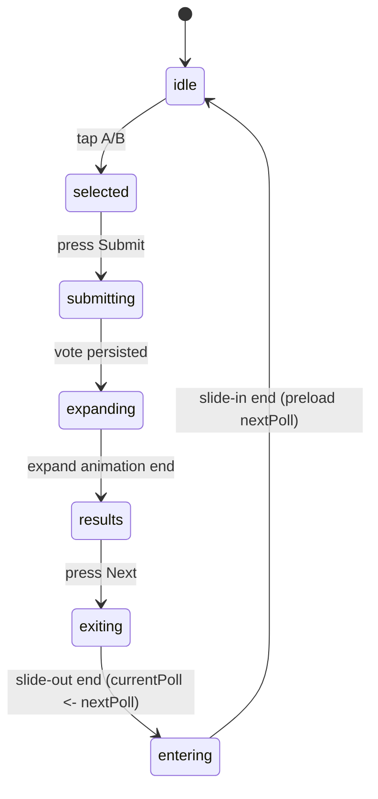

## Vote Transitions and Footer Redesign (Plan)

This document defines the UI/UX, states, and animations for the battle (vote) flow. It replaces the current header with a persistent footer action bar to reclaim vertical space, and specifies smooth transitions for submit/results/next.

### Goals

- Reduce vertical chrome and keep fit cards fully visible on small screens.
- Replace top header with a bottom action bar containing contextual controls.
- Smooth, continuous transitions:
  - Selected card expands into the results view (no screen jump).
  - Bottom bar morphs from Submit → Percent Bar + Next.
  - On Next, the expanded card slides off-screen and the next battle slides in.
- Respect prefers-reduced-motion.

### Footer Action Bar (replaces header during battle)

- Always anchored with safe-area padding: bottom-4 inset-x-4 + env(safe-area-inset-bottom).
- Three zones (flex row):
  - Left: circular Back button (48–56px). Taps navigate to landing.
  - Center: context element.
    - Voting phases (idle/selected/submitting): primary Submit pill button (fills remaining width).
    - Results phase: morphs to a rounded percent bar with animated fill and percentage text.
  - Right: context element.
    - Voting phases: hidden (or reserved 48px spacer to keep center width stable).
    - Results phase: Next primary button (56–64px, slightly larger than back).
- Elevation: subtle shadow; blends with bg-zinc-950.

### State Machine

- phase: `idle` → `selected` → `submitting` → `expanding` → `results` → (`exiting` → `entering`) → `idle`.
- selectedSide: `"A" | "B" | null`.
- currentPoll: poll presented to user.
- nextPoll: preloaded poll to enable instant Next transition.

### Animation Specs

- Card select (idle/selected):
  - Instant emerald ring, slight scale to 0.98→1.00 on selection.
- Submit → Expand (submitting→expanding):
  - Keep the chosen card in place; animate to expanded height (≈ 60–65dvh) with rounded corners preserved.
  - Inner content fades from grid to expanded media layout.
  - Duration: 280–340ms ease-out.
  - Trigger `results` only on `animationend` of the expand container.
- Bottom bar morph:
  - Submit button fades out and collapses width while the percent bar fades in (cross-fade). Duration 200–240ms.
  - Next button fades/scale-in on the right with 80ms delay = perceived morph.
- Next (results→exiting→entering):
  - Expanded card slides vertically off-screen (direction based on which side won: A slides up, B slides down) over 260–320ms ease-in.
  - While sliding out, bottom bar fades out.
  - Swap `currentPoll <- nextPoll` when slide-out ends; reset selection and set phase `entering`.
  - New battle cards slide in from the opposite direction (or quick fade-in if reduced motion) over 220–280ms.
- Reduced motion:
  - No movement; use opacity changes only and immediate state swaps.

### Layout Details

- Keep the small center "versus" label between cards; ensure tighter vertical spacing so both cards fit.
- Expanded card target height: `min-h-[62dvh]` (tunable), scroll disabled during expanding/exiting.

### Data & Timing

- On Submit:
  1. Persist vote via `voteOnPoll`.
  2. Set `phase = "submitting"`; after response set `phase = "expanding"` to trigger CSS.
  3. When `expand` animation ends, compute percentages and set `phase = "results"`.
- On Results (render):
  - Show percent bar in center; show Next at right; keep Back at left.
- On Next:
  1. Set `phase = "exiting"` and start slide-out.
  2. On slide-out end, swap `currentPoll` and `nextPoll`, prefetch upcoming `nextPoll`, reset state, then `phase = "entering"` to slide-in.
  3. On slide-in end, `phase = "idle"`.

### Components/Responsibilities

- BottomActionBar (new): renders Back/Center/Right controls per phase.
- BattleCard: accepts `isSelected`, `isExpanded`, `exitDirection` ("up" | "down") to drive animations.
- Vote screen: manages `phase`, selection, current/next poll, and prefetching.

### CSS Keyframes (to be added)

- expand-to-full: scale(0.98)→1, height grows; opacity 0.92→1.
- fade-in / fade-out utilities for cross-fades.
- slide-out-up / slide-out-down and slide-in-up / slide-in-down.
- Respect `prefers-reduced-motion` to disable transforms and rely on opacity.

### Edge Cases

- No polls available: keep footer with just Back; center shows disabled state.
- Very tall/short devices: clamp expanded height to 58–68dvh with safe-area padding.
- Double-taps: disable Submit during `submitting/expanding`; disable Next during `exiting`.

### Acceptance Criteria

- Cards never jump or re-mount between Submit and Results.
- Bottom bar morphs smoothly; Next appears only in results.
- Next transitions are directional (A→up, B→down) and feel continuous.
- Reduced motion yields a fast but non-jarring experience.
